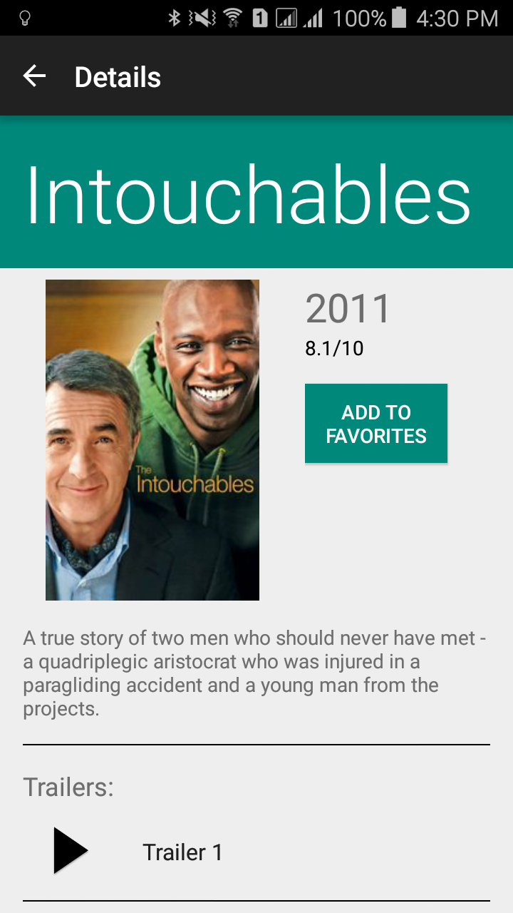

# Pop Movies
This is the final project that students are required to do in
[Developing Android Apps (Udacity)](https://www.udacity.com/course/developing-android-apps--ud853). The
project requirements and mockups can be found [here](https://docs.google.com/document/d/1ZlN1fUsCSKuInLECcJkslIqvpKlP7jWL2TP9m6UiA6I/pub?embedded=true#h.7sxo8jefdfll).
The criteria for passing this project can be found [here](https://review.udacity.com/#!/rubrics/67/view)
and [here](http://udacity.github.io/android-nanodegree-guidelines/core.html).

### Instructions
Add `movieDBApiKey="API-KEY"` to `~/.gradle/gradle.properties`. This can be found at www.themoviedb.org

### Screenshots

